# AluPC – Monitor 2 steuern

AluPC steuert einen **zweiten Monitor für andere Leute** (Beamer, Kundenmonitor, Fernseher …),
während du am **Hauptmonitor** normal weiterarbeitest. Läuft unter **Kubuntu** (KDE Plasma,
Wayland und X11) und **Windows 11 Pro**.

Bedienung ohne Schnickschnack: große Kacheln, ein Klick – fertig. Keine Vorschau, kein
OBS-Studio-Fenster.

| Dunkel | Hell |
|---|---|
| 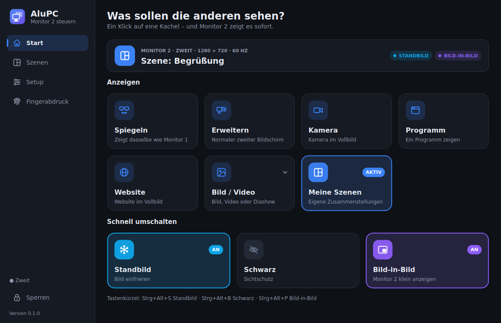 | 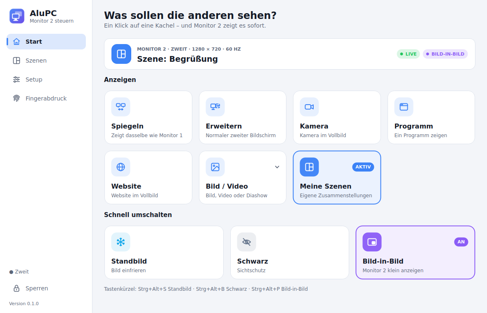 |

## Design

- Eigenes, modernes Design mit **Seitenleiste**, **Statuskarte** („Was sehen die anderen gerade?“
  mit LIVE / STANDBILD / SCHWARZ) und großen Kacheln, die ihren Zustand zeigen („AKTIV“, „AN“).
- **Dunkel, Hell oder wie das System**, dazu 5 **Akzentfarben** (Setup → Darstellung).
- Alle Symbole sind selbst gezeichnet – sehen unter Kubuntu und Windows gleich scharf aus
  (keine Emojis, die je nach System anders aussehen).
- **Übergänge zwischen Szenen** auf Monitor 2: Überblenden, über Schwarz, Wegschieben, Wischen,
  Zoom oder harter Schnitt, Dauer einstellbar (Setup → Darstellung); jede Szene kann einen eigenen
  Übergang haben (Szenen-Editor).
- Kurze **Hinweise** unten im Fenster statt Fehlerfenster, **Fortschrittsring** beim
  Fingerabdruck, grafische **Monitor-Anordnung** im Setup, **Szenen als Karten** mit Vorschau.

## Funktionen

| Kachel | Was passiert auf Monitor 2 |
|---|---|
| **Spiegeln** | zeigt dasselbe wie Monitor 1 – mit Mauszeiger (AluPC nimmt Monitor 1 auf – dadurch gehen Standbild und Sichtschutz) |
| **Erweitern** | Monitor 2 ist ein normaler zweiter Bildschirm |
| **Kamera** | eine Kamera im Vollbild – **Klick startet sofort die Standard-Kamera** (vorausgewählt: die gewählte, sonst die erste), der Pfeil wählt eine andere (die dann Standard wird; auch in Setup → Handy & Kamera, samt Anzeige „füllen“/„ganzes Bild“). Läuft eine Kamera (auch in einer Szene), erscheint im Hauptfenster die **Kamera-Leiste**: **Zoom 1–5×** (optisch, wenn die Kamera das kann, sonst digital), Ausschnitt verschieben, **spiegeln**, **um 90° drehen**, **Helligkeit** (wenn die Kamera das unterstützt), Zurücksetzen. Gilt pro Kamera und bleibt gespeichert. AluPC wählt automatisch das schärfste flüssige Kamerabild bis Full HD |
| **Programm** | ein Programm zeigen: *Anzeigen (Aufnahme)* oder *Fenster wirklich verschieben* |
| **Website** | Adresse eingeben oder gespeicherte Website wählen → Vollbild. Pfeil an der Kachel: gespeicherte Websites, **Browser steuern** (eigenes Fenster: Adresse, Zurück/Vor, Zoom, Scrollen, Live-Vorschau zum Klicken und Tippen, **Stift/Marker/Radierer zum Zeichnen auf der Website**; bei **Standbild** zeigt die Vorschau die echte Seite dahinter – schon weiterklicken, während das Publikum noch das Standbild sieht), aktuelle Seite **unter „Website“ speichern** |
| **Bild / Video** | **Mediathek** mit Vorschaubildern: gespeicherte Bilder, Videos und Diashows, dazu automatisch „Zuletzt gezeigt“; Filter, Suche, Umbenennen. Pfeil an der Kachel: gespeicherte Einträge direkt starten. Läuft ein Video (auch in einer eigenen Szene), erscheint oben eine **Mediensteuerung**: Pause/Weiter, ±10 Sekunden, Zeitleiste zum Springen |
| **Handy** | eigenes **Fenster „Handy“** mit zwei Wegen. **Jedes Handy** (QR-Code scannen, ohne App) – die Handy-Seite hat vier Reiter: **Start** (Live-Bild mit Laserpointer, Schwarz/Standbild/Spiegeln/Erweitern/Schoner, Kamera/iPhone/QR-Code/Timer zeigen, Szenen, Video, Lautstärke, **Timer mit Vorgaben** 1–15 min, RGB), **Zeichnen** (mit dem Finger **direkt auf Monitor 2**: Stift, Marker, Radierer, Laser, 7 Farben, Rückgängig, Vollbild), **Folien** (Präsentations-Klicker und **Touchpad für die PC-Maus** mit Klick, Rechtsklick und Scrollen) und **Senden** (Foto/Video, Link, Text). Lässt sich als **App auf den Home-Bildschirm** legen. Was Handys dürfen, stellt man in **Setup → Handy & Kamera** ein. **iPhone & iPad** per AirPlay (UxPlay; unter Windows „uxplay-windows“): Monitor 2 zeigt sofort einen **Warte-Bildschirm mit Name und Code**, beim Verbinden legt AluPC das iPhone-Bild randlos darüber. **Richtet sich selbst ein** (Kubuntu: Pakete mit einem Passwort; Windows: uxplay-windows, Bonjour und Firewall-Freigabe) |
| **Vorlagen** | **32 fertige Karten** mit eigenem Text – Design-Karten (Neon-Schild, Glitch, Synthwave, Poster, Minimal, Spotlight, Now Playing, LIVE-Overlay, Versus, Link-Karte mit QR, Coming soon, Glas) und Info-Karten (Willkommen, Agenda, Pause, Laufschrift, Zitat, Ankündigung, Fragen, WLAN-QR, Countdown bis Uhrzeit, Geburtstag, Tabelle/Line-up, Quiz, Danke, Schlagzeile, Große Zahl, Termine, Siegerehrung, Pro & Contra, Stichwort, Gäste) – plus **24 fertige Szenen** (Stream-Overlay, Partynacht, Gaming-Duell, Retro-Abend, Musik, Link teilen …). Kategorien und Suche; sofort zeigen (ohne Speichern) oder als eigene Szene im Editor anlegen |
| **Meine Szenen** | eigene, selbst gebaute Szenen (siehe unten) |
| **Schwarz** | Sichtschutz an/aus – schwarz, eigener Text oder eigenes Bild/Logo |
| **Standbild** | friert das Bild auf Monitor 2 ein; du arbeitest auf Monitor 1 unbemerkt weiter |
| **Bild-in-Bild** | kleines Fenster auf Monitor 1, das live zeigt, was auf Monitor 2 läuft (mit Hinweis „STANDBILD“/„SCHWARZ“) |
| **Bildschirmschoner** | Uhr, Analoguhr, Klappuhr, schwebender Text/Logo, Nachricht, Diashow, Farbverlauf, Matrix, Code-Editor, Terminal, Netzwerk, Sternenflug, Polarlicht, Lavalampe, Lichtkugeln, Meer, Feuerwerk, Schneefall, Sprüche/Zitate oder eigene Szene – automatisch nach X Minuten ohne Maus/Tastatur oder per Klick |
| **Zeigen & Zeichnen** | eigenes Fenster auf Monitor 1 mit Live-Bild von Monitor 2: darin mit dem **Laserpointer** zeigen oder mit **Stift/Textmarker** in 8 Farben (+ eigene) kritzeln, Radierer, Rückgängig, Alles löschen – erscheint sofort auf Monitor 2. **Zeichnungen bleiben stehen** (auch nach Schließen des Fensters und Neustart), bis man sie löscht oder die Szene wechselt. Vorschau mit 10–60 Bildern/s. Öffnen über Kachel, Taskleisten-Menü oder `Strg+Alt+K` |

Außerdem:

- **RGB & Lüfter** (eigene Seite links): **RGB-Beleuchtung** aller Geräte, die das kostenlose
  **OpenRGB** kennt (Mainboard, RAM, Grafikkarte, Lüfter-LEDs, Tastatur …) – Farbe wählen, Helligkeit,
  aus, oder **„Farbe folgt Monitor 2“** (die LEDs leuchten in der Farbe dessen, was gerade gezeigt wird).
  AluPC spricht das OpenRGB-Protokoll selbst; OpenRGB muss installiert sein (AluPC startet es mit
  SDK-Server). **Temperaturen und Lüfter** (Linux): alle Sensoren live, steuerbare Lüfter per Regler
  (nie unter 30 %, „Automatisch“ gibt die Regelung ans Mainboard zurück, Administrator-Passwort nötig).
- **Sichern & Sync** (Setup): Einstellungen **exportieren/importieren** – alles oder z. B. nur die
  **Startseite**. **Dual-Boot-Abgleich Windows ↔ Linux**: beide Systeme nutzen einen Ordner
  „AluPC-Sync“ auf dem Windows-Laufwerk; AluPC gleicht beim Start und nach jeder Änderung automatisch ab
  (Startseite, Szenen, Favoriten, Tastenkürzel, Design, Bildschirmschoner, Töne, Handy, RGB).
- **Startseite anpassen** (Knopf oben rechts auf der Startseite): Kacheln ein-/ausblenden und
  sortieren, eigene Überschrift, Statuskarte an/aus und **eigene Kacheln** – z. B. „Begrüßung“
  (zeigt eine Szene), „Pausen-Uhr“ (zeigt eine Uhr) oder „Standbild“ (führt einen Befehl aus),
  jeweils mit eigenem Symbol, eigener Farbe und eigenem Tastenkürzel.

  | Startseite | Anpassen | Eigene Kachel |
  |---|---|---|
  | 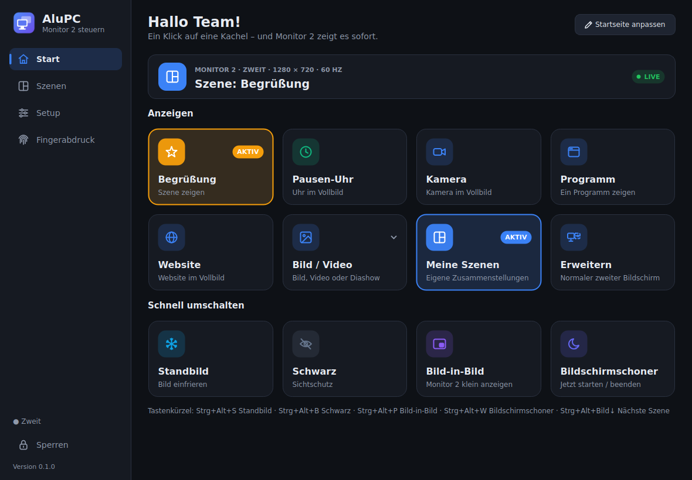 | 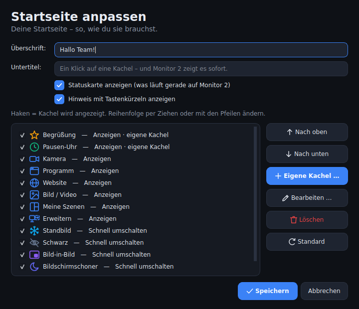 | 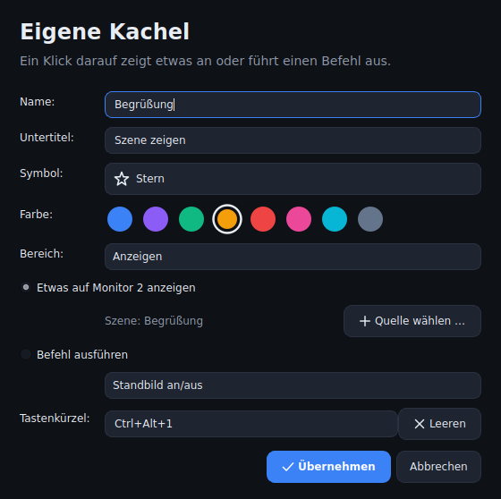 |

- **Bildschirmschoner** (Setup → Bildschirmschoner): startet nach 1–240 Minuten ohne Maus/Tastatur
  (unter Windows und KDE vom System gemeldet) – wahlweise nur, wenn AluPC gerade nichts zeigt, oder
  immer. Maus bewegen beendet ihn; von Hand gestartet (Kachel/Tastenkürzel) bleibt er, bis man ihn
  wieder ausschaltet. Sichtschutz liegt immer darüber.

  Stile: Uhr, Nachricht (großer Text + kleine Uhr, optional Hintergrundbild), schwebender Text/Logo,
  Diashow, Farbverlauf, eigene Szene; Textfarbe wählbar. Einstellungen auch direkt über den Pfeil
  an der Kachel.

  | Uhr | Farbverlauf |
  |---|---|
  | 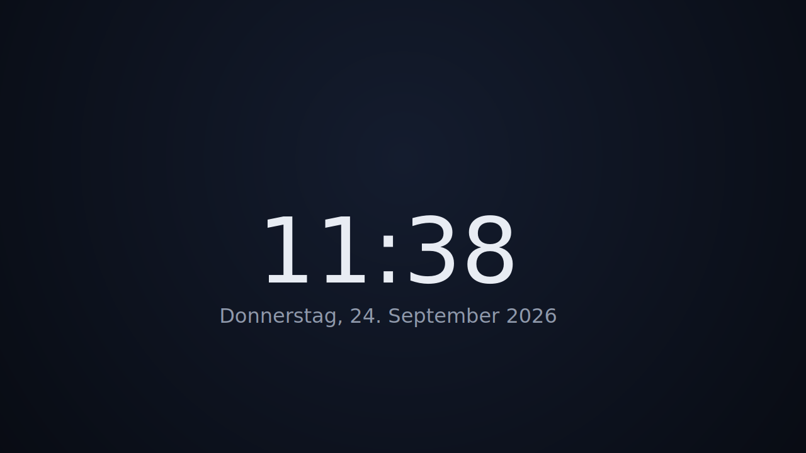 |  |

- **Eigene Szenen** (Seite *Szenen*): Es gibt keine vorgefertigten Szenen. Du wählst eine
  **Layout-Vorlage** (Vollbild, 2 nebeneinander, 2 übereinander, groß + klein in einer Ecke,
  2 × 2, 1 groß + 2 klein, Vollbild + Textleiste) und legst in jedes Feld eine Quelle:
  Kamera, Programm, Bildschirm, Website, Bild, Video, Diashow, Text, Uhr, Countdown,
  Farbfläche oder eine andere Szene.
- **Ton pro Medium**: Videos und Websites haben eine eigene Lautstärke und „Ton aus“ (in der
  Quelle einstellbar). Läuft etwas mit Ton auf Monitor 2, erscheint oben im Hauptfenster ein
  Lautstärkeregler, und im Taskleisten-Menü gibt es „Ton auf Monitor 2“.
- **Programm aufnehmen im Hintergrund**: Das aufgenommene Programm darf hinter anderen Fenstern
  liegen. Minimierte Programme liefern kein Bild – unter Windows holt AluPC sie (abschaltbar)
  automatisch zurück, legt sie aber ganz nach hinten, ohne sie zu aktivieren.

  | Szenen | Szenen-Editor | Ergebnis auf Monitor 2 |
  |---|---|---|
  | 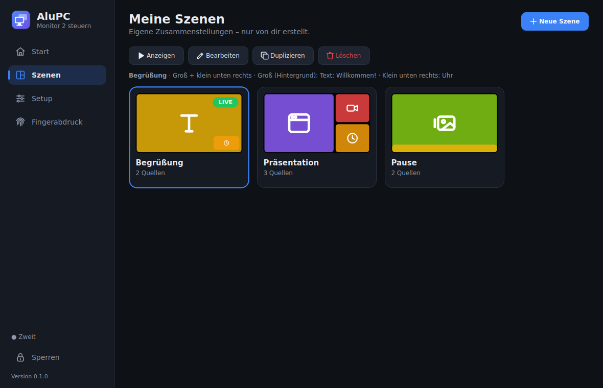 | 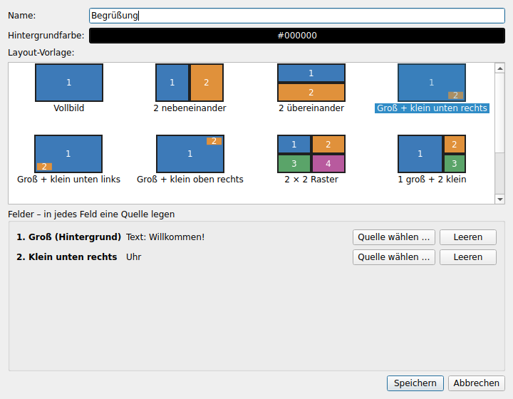 | 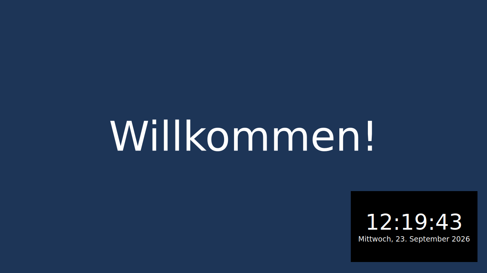 |
- **Setup**: Auflösung, **Bildwiederholrate (Hz)**, Skalierung (KDE/Wayland), Drehung,
  Hauptmonitor, Anordnung (rechts/links/oben/unten/gespiegelt). Nach „Übernehmen“ fragt AluPC
  „Einstellungen behalten?“ – ohne Antwort wird nach 15 Sekunden zurückgesetzt.
  „Monitore identifizieren“ zeigt auf jedem Monitor eine große Nummer.
- **Fingerabdruck** (Seite *Fingerabdruck*): **„Automatisch einrichten“** erledigt alles in einem
  Durchgang – unter Linux fehlende Pakete installieren (fprintd, libpam-fprintd), Sensor suchen,
  Finger anlernen, Test-Scan, Anmeldung einschalten; unter Windows Sensor suchen, Windows Hello
  öffnen, Test-Scan. Findet fprintd keinen Sensor, schaut AluPC am USB nach und sagt, welcher
  Sensor verbaut ist und ob es einen Zusatztreiber gibt. Einzeln geht weiterhin: Sensor wählen,
  Finger anlernen, Test-Scan, Finger löschen, Anmeldung ein/aus (Details unten).

  | Setup | Finger anlernen | Bild-in-Bild |
  |---|---|---|
  | 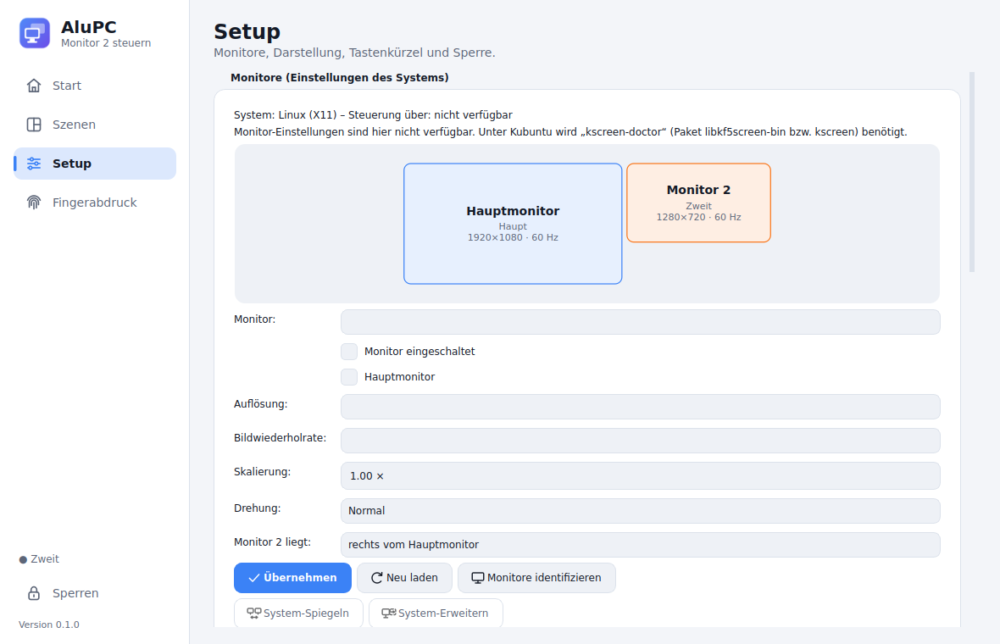 | 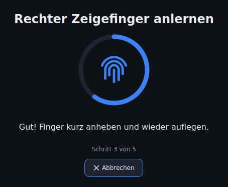 | 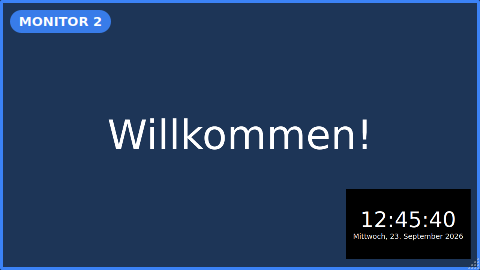 |
- **Tastenkürzel** (Setup → Tastenkürzel: auf das Kürzel klicken, neue Tasten drücken – fertig;
  „Kein Kürzel“ entfernt es):

  | Aktion | Standard |
  |---|---|
  | Standbild an/aus | `Strg+Alt+S` |
  | Schwarz an/aus | `Strg+Alt+B` |
  | Bild-in-Bild an/aus | `Strg+Alt+P` |
  | Bildschirmschoner an/aus | `Strg+Alt+W` |
  | Nächste / vorherige Szene | `Strg+Alt+Bild↓` / `Strg+Alt+Bild↑` |
  | Timer Start/Pause | `Strg+Alt+T` (Neustart, ±1 Minute frei belegbar) |
  | Zeigen & Zeichnen | `Strg+Alt+K` |
  | Spiegeln | `Strg+Alt+M` |
  | Erweitern | `Strg+Alt+E` |
  | jede Szene | frei wählbar im Szenen-Editor |
  | jede eigene Kachel | frei wählbar unter „Startseite anpassen“ |

  Doppelt vergebene Kürzel meldet AluPC.

- **Steuern über die Taskleiste**: Ein Klick auf das AluPC-Symbol öffnet ein Schnellmenü
  (Standbild, Schwarz, Bildschirmschoner, Bild-in-Bild, Timer, Spiegeln, Erweitern, Szenen,
  Computer sperren). Das Symbol zeigt den Zustand (Schneeflocke = Standbild, Auge = Schwarz,
  Mond = Bildschirmschoner). Doppelklick öffnet AluPC.
  Fenster schließen = AluPC läuft im Hintergrund weiter.
- **Autostart**, letzten Inhalt beim Start wiederherstellen, Monitor wird nach dem
  Wieder-Anstecken automatisch wieder benutzt.
- **Computer sperren** (Seitenleiste, Taskleisten-Menü, Befehl `sperren`): wie Win+L bzw. die
  Bildschirmsperre unter Linux – Monitor 2 zeigt dabei weiter, was gerade läuft.
- **Töne** (Setup → Töne): Ton bei Standbild an/aus, Schwarz an/aus, neuem Inhalt, Szenenwechsel,
  Bildschirmschoner, Timer-Start/-Pause, „noch 1 Minute“, Timer-Ende … – 7 eingebaute Klänge oder
  eigene Dateien hochladen (WAV, MP3, OGG …). Lautstärke und Ausgabegerät (z. B. HDMI des Beamers)
  wählbar. Eigene Kacheln können einen eigenen Ton haben.
- **Eigene Kacheln – mehr Möglichkeiten**: etwas anzeigen, **eigener Bildschirmschoner** (z. B.
  „Pause – gleich geht's weiter“ mit Hintergrundbild; nochmal klicken = beenden), **Timer mit eigener
  Dauer** oder ein Befehl – jeweils mit eigenem Symbol, Farbe, Ton und Tastenkürzel.
- **Setup in Bereichen**: Monitore, Monitor 2, Darstellung, Bildschirmschoner, Timer, Töne,
  Tastenkürzel, Allgemein.
- **Timer** (Kachel „Timer“): Countdown oder Stoppuhr, läuft durch – auch wenn Szenen neu
  aufgebaut werden. Klick = Start/Pause (beim ersten Mal wird er auf Monitor 2 gezeigt), Pfeil =
  Neu starten, ±1 Minute, Einstellen. Letzte Minute orange, letzte 10 Sekunden rot, am Ende blinkt
  er. Tastenkürzel: `Strg+Alt+T` = Start/Pause (weitere frei belegbar).
- **Standbild-Symbol**: kleine Schneeflocke oben rechts auf dem eingefrorenen Bild (abschaltbar
  unter Setup → Monitor 2).
- **Monitor 2 bleibt vorne**: Wird das Fenster verdeckt oder minimiert (z. B. Win+D), holt AluPC es
  sofort zurück. Unter Windows wird die Taskleiste auf Monitor 2 ausgeblendet, solange AluPC dort
  etwas zeigt (abschaltbar), unter KDE wird das Fenster über die Leisten gelegt.

## Installation

Fertige Pakete gibt es unter **[Releases](https://github.com/SG-Junior-FLL/AluPC/releases)**:

| System | Datei | So geht's |
|---|---|---|
| **Windows 11** | `AluPC-Setup-….exe` | Doppelklick, installieren – AluPC steht im Startmenü |
| Windows 11 | `AluPC-windows-portable-….zip` | entpacken, `AluPC.exe` starten |
| **Kubuntu / Ubuntu 22.04, 24.04+** | `alupc_…_amd64.deb` | `sudo apt install ./alupc_…_amd64.deb` – AluPC steht im Startmenü |
| Linux x86_64 | `AluPC-linux-x86_64-….tar.gz` | entpacken, `AluPC/AluPC` starten |

Für den Fingerabdruck unter Linux braucht es `fprintd` und `libpam-fprintd` – das .deb empfiehlt sie,
und „Fingerabdruck → Automatisch einrichten“ installiert sie bei Bedarf selbst (Passwortabfrage).

Die portable Linux-Version trägt sich beim ersten Start selbst ins Startmenü ein (mit Logo).

**Aus dem Quellcode (Kubuntu):**

```bash
git clone https://github.com/SG-Junior-FLL/AluPC.git
cd AluPC
./packaging/linux/install.sh      # entfernen: ./packaging/linux/uninstall.sh
```

**Aus dem Quellcode (Windows):** Python 3.10+ installieren, dann
`packaging\windows\start-aus-quellcode.bat` doppelklicken.

Jeder Build auf GitHub wird automatisch geprüft: Tests, Start der fertigen Programmdatei,
unter Windows zusätzlich der installierte Installer und unter Linux das installierte .deb-Paket.

## Befehle von außen

Ein laufendes AluPC lässt sich von der Kommandozeile steuern:

```bash
alupc --befehl standbild      # auch: schwarz, bild-in-bild, bildschirmschoner, spiegeln, erweitern,
                              #       naechste_szene, vorherige_szene, sperren, zeigen
alupc --befehl kamera_zoom_plus   # auch: kamera_zoom_minus, kamera_zoom_aus
alupc --befehl rgb_monitor2       # auch: rgb_farbe, rgb_aus
alupc --befehl "szene:Begrüßung"
alupc --minimiert             # nur mit Symbol in der Taskleiste starten
```

**Tastenkürzel überall in KDE:** Unter Windows gelten die Kürzel automatisch systemweit.
In KDE funktionieren sie innerhalb von AluPC sofort. Für systemweite Kürzel stehen die wichtigsten
Aktionen nach der Installation unter *Systemeinstellungen → Tastatur → Kurzbefehle → AluPC* bereit
(Taste zuweisen, fertig). Setup → Tastenkürzel hat dafür den Knopf „KDE-Kurzbefehle öffnen“.
Für Szenen: *Neu hinzufügen → Befehl* mit `alupc --befehl "szene:Name"`.

## Fingerabdruck – was geht wo

| | Kubuntu | Windows 11 |
|---|---|---|
| Sensor auswählen | ✔ (fprintd) | ✔ (anzeigen) |
| Finger anlernen | ✔ direkt in AluPC | über Windows Hello – AluPC öffnet die Seite direkt |
| Angelernte Finger anzeigen | ✔ | ✔ |
| Test-Scan | ✔ | ✔ |
| Finger löschen | ✔ | nur in den Windows-Einstellungen |
| Anmelden mit Fingerabdruck | ein/aus über `pam-auth-update` (gilt für Anmeldebildschirm, Sperrbildschirm, sudo) | automatisch aktiv, sobald ein Finger in Windows Hello angelernt ist |

### Fingerabdruckmodul am USB-Seriell-Adapter (z. B. Hi-Link HLK-ZW101 / ZW0922)

Diese Module (auch AS608, R307 und andere mit „EF01“-Protokoll) vergleichen Fingerabdrücke selbst
und hängen über einen USB-Seriell-Adapter (CH340, CP2102 …) am PC. Windows Hello und libfprint
kennen sie nicht – AluPC steuert sie direkt. Steckt so ein Modul, nimmt AluPC automatisch das Modul.

| | Kubuntu | Windows 11 |
|---|---|---|
| Modul finden (Anschluss + Baudrate automatisch) | ✔ | ✔ (CH340-Treiber kommt meist über Windows Update) |
| Finger anlernen (2× auflegen), anzeigen, löschen, Test-Scan | ✔ | ✔ |
| Anmelden / Entsperren / sudo | ✔ nur mit dem **.deb** (über PAM, `pam_exec`) | ✘ Windows lässt nur Windows-Hello-Sensoren zu |

- **Kubuntu:** „Automatisch einrichten“ findet das Modul, lernt den Finger an, testet und schaltet die
  Anmeldung ein. Blockiert der Dienst **brltty** den CH340-Adapter (bekanntes Ubuntu-Problem), bietet
  AluPC an, ihn zu entfernen. Beim Anmelden/Entsperren/sudo hat man ca. 6 Sekunden, um den Finger
  aufzulegen – sonst geht es mit dem Passwort weiter (das Passwort funktioniert immer). Am
  Sperrbildschirm startet die Prüfung je nach Plasma-Version erst nach Enter.
- **Sicherheit:** Der PC vertraut der Antwort des Moduls („passt“), und das Modul hat keinen
  Zugriffsschutz: Wer den Adapter öffnen darf, kann Finger in beliebige Speicherplätze schreiben.
  Gibt es **mehrere Benutzerkonten**, warnt AluPC deshalb vor dem Einschalten und schaltet die Anmeldung
  nur nach ausdrücklicher Bestätigung ein: Ein anderer Benutzer könnte mit etwas Technik seinen Finger
  für dein Konto eintragen. AluPC selbst verhindert das (jeder sieht und löscht nur seine eigenen Finger,
  fremde Plätze werden nie überschrieben) – nur nicht bei Absicht. Nur einschalten, wenn du allen
  Benutzern des PCs vertraust. Wer an den PC kommt und das Modul
  gegen ein manipuliertes Gerät tauscht, könnte es ebenfalls ausnutzen – sicherer als ein Passwort ist
  es nicht. Das Prüfprogramm läuft als root; deshalb geht die Anmeldung nur
  mit dem installierten .deb (Programmdatei gehört root), nicht mit der portablen Version.
- Getestet ist der Treiber gegen ein nachgebautes Modul (gleiches Protokoll), nicht gegen ein echtes.

## Wenn etwas nicht geht

**Setup → Allgemein → „Diagnose kopieren“** prüft Monitore, macht eine kurze Probe-Aufnahme fürs Spiegeln,
prüft AirPlay (UxPlay bzw. uxplay-windows samt dessen Protokoll, avahi/Bonjour), RGB und Lüfter –
und kopiert das Ergebnis in die Zwischenablage. **„Ersteinrichtung starten“** daneben richtet alles neu ein.

- **Spiegeln zeigt nichts:** AluPC schaltet nach 4 s ohne Bild selbst auf das Spiegeln des
  Betriebssystems um. Unter Kubuntu/Wayland fragt das System beim ersten Mal, welcher Bildschirm geteilt
  werden soll (mit dem .deb unter KDE nicht nötig).
- **iPhone findet den PC nicht:** gleiches WLAN? Unter Kubuntu muss der Dienst avahi laufen, unter
  Windows „Bonjour“ installiert sein – „Ersteinrichtung starten“ erledigt das. Schul-/Gäste-WLANs
  trennen Geräte oft voneinander, dann geht AirPlay dort nicht.
- **Windows-Firewall:** Setup.exe (mit Adminrechten) bzw. die Ersteinrichtung (eine Windows-Abfrage) gibt
  Handy-Steuerung und AirPlay für **private** Netzwerke frei. Steht das WLAN in Windows auf „Öffentlich“,
  bitte auf „Privat“ stellen – sonst erreichen Handys den PC nicht.
- **QR-Code öffnet nichts / Handy bietet nur „Link kopieren“:** meist steht im QR-Code eine Adresse, die das
  Handy nicht erreicht (VPN, WSL, virtuelle Netze). AluPC nimmt jetzt automatisch die WLAN-Adresse; im
  Handy-Fenster lässt sich die Adresse auch von Hand wählen.

## Ehrliche Grenzen

- **Nicht auf echter Hardware getestet.** Die automatischen Tests laufen auf GitHub unter Linux und
  Windows (inkl. Start der fertigen Programme und der installierten Pakete) – aber ohne echte Monitore,
  Kameras und Fingerabdrucksensoren. Bitte Fehler mit Screenshot oder Meldungstext melden.
- **Chromecast-Empfang geht nicht**: Google lässt als Empfänger nur zertifizierte Geräte zu. Einen
  eigenen „AirPlay“ oder „Chromecast“ nachzubauen geht auch nicht sinnvoll: AirPlay-Bildschirm­übertragung
  ist mit Apples FairPlay verschlüsselt, Chromecast mit Google-Zertifikaten. Deshalb gibt es
  **AluCast** (Browser, QR-Code) als eigenen Weg – das kann aber **nicht den Handy-Bildschirm
  übertragen** (das erlauben Handy-Browser nicht), sondern Fotos, Videos, Links, Text und Fernbedienung.
- **AluCast** läuft ohne Verschlüsselung (http) im eigenen WLAN; der Code schützt vor Fremden, aber
  jeder, der den QR-Code auf Monitor 2 sieht, kann senden („Neuer Code“ im Einrichten-Dialog). In
  Gäste-/Schul-WLANs, die Geräte voneinander trennen, erreichen Handys den PC nicht. Windows fragt beim
  ersten Start nach der Firewall-Freigabe. Live-Kamerabild vom Handy geht nicht (bräuchte https).
- **RGB** geht nur mit installiertem **OpenRGB** (openrgb.org) und nur für Geräte, die OpenRGB kennt.
  Hersteller-Programme (iCUE, Armoury Crate, Mystic Light …) vorher beenden. AluPCs OpenRGB-Anbindung
  ist nach der offiziellen Protokollbeschreibung gebaut und gegen einen nachgebauten Server getestet –
  **nicht mit echtem OpenRGB und echten LEDs**.
- **Lüfter** nur unter **Linux** und nur, wenn der Kernel die Regler des Mainboards kennt (oft Treiber
  „nct6775“/„it87“, Paket lm-sensors; manche Mainboards brauchen die Kernel-Option
  `acpi_enforce_resources=lax`). Laptops melden meist keine steuerbaren Lüfter. **Unter Windows gibt es
  keine allgemeine Schnittstelle** – dort Hersteller-Programm oder „FanControl“ nutzen. Keine
  Lüfterkurven (dafür bräuchte es einen ständig laufenden Administrator-Dienst); nach einem Neustart
  regelt wieder das Mainboard. Nicht auf echter Hardware getestet.
- **Dual-Boot-Abgleich**: Windows kann keine Linux-Laufwerke lesen – der Ordner muss auf dem
  Windows-Laufwerk (oder einer gemeinsamen NTFS/exFAT-Partition) liegen. Ist in Windows der
  **„Schnellstart“** an, darf Linux das Windows-Laufwerk nur lesen – dann in Windows Schnellstart
  ausschalten. Ist das Laufwerk unter Linux nicht eingehängt, versucht AluPC es selbst (klappt je nach
  System nur mit Passwort – dann „Windows-Laufwerk einhängen …“). Dateipfade (z. B. Bilder in Szenen)
  gelten nur, wenn die Datei auf beiden Systemen am gleichen Ort liegt. Mit echtem Dual-Boot nicht
  getestet – getestet mit zwei simulierten Systemen und einem gemeinsamen Ordner.
- **Kamera-Zoom**: Die meisten Webcams haben keinen optischen Zoom – dann ist es ein digitaler Ausschnitt
  (wird bei starkem Zoom unscharf). Helligkeit nur bei Kameras, die das über Qt anbieten.
- **AirPlay braucht das freie Programm UxPlay** (wird nicht mitgeliefert, AluPC installiert es). Kubuntu
  24.04 hat nur UxPlay 1.68: Das läuft im eigenen Fenster, nicht als AluPC-Quelle. Laut UxPlay-Projekt
  wurde in 1.72.3 eine Sicherheitslücke geschlossen (CVE-2025-60458) – ältere Versionen nur im
  vertrauenswürdigen WLAN und am besten mit Code verwenden.
- **AirPlay unter Windows** läuft über **„uxplay-windows“** (winget-Paket `leapbtw.uxplay`): ein
  **Community-Paket** eines einzelnen Entwicklers, das UxPlay für Windows fertig baut – nicht vom
  UxPlay-Projekt selbst, nicht signiert (Windows Defender kann warnen). AluPC schreibt Name und Code in
  dessen `arguments.txt` (`%APPDATA%\leapbtw\uxplay-windows`), startet und beendet es und legt dessen
  Videofenster **randlos und im Vordergrund** genau über Monitor 2 (abschaltbar: dann maximiert). Das Bild
  ist dort keine AluPC-Quelle (keine Szenen, kein Standbild). Ältere uxplay-windows-Versionen (1.x) haben
  keine Einstellungsdatei – dort startet AluPC deren mitgeliefertes `uxplay.exe` direkt. Läuft uxplay-windows
  schon (eigener Autostart), beendet AluPC es beim AirPlay-Start – es darf nur einen Empfänger geben.
- **Touchpad und Folien per Handy** gehen unter Windows und unter Linux mit X11 – **nicht unter Wayland**
  (das erlaubt Programmen keine fremden Klicks/Tasten). Die Lautstärketasten des Handys lassen sich im
  Browser nicht abfangen.
- **Mit echten iPhones ist AirPlay nicht getestet.** Geprüft ist: unter Linux startet echtes UxPlay und
  wird per avahi angekündigt; unter Windows (GitHub-Rechner) startet AluPC uxplay-windows, Port 7000 ist
  offen und der PC wird per Bonjour mit seinem Namen angekündigt.
- **Fingerabdruck unter Linux** geht nur mit Sensoren, die **libfprint** unterstützt.
  Viele neuere Notebook-Sensoren (z. B. manche von Goodix/Synaptics) werden nicht erkannt.
- **Windows erlaubt Fremdprogrammen nicht**, Finger für die Windows-Anmeldung anzulernen oder
  zu löschen – das geht nur über Windows Hello. Ist „Erweiterte Anmeldesicherheit“ (ESS) aktiv,
  kann Windows den Sensor für AluPC (Test-Scan) ganz sperren.
- **Wayland (KDE)**: Spiegeln, Bild-in-Bild und Standbild nehmen den Bildschirm direkt über KWin
  auf – **ohne Nachfrage**, wie unter Windows. KWin erlaubt das nur der installierten AluPC-Datei
  (.deb, oder portable Version nach dem ersten Start). Beim Start aus dem Quellcode fragt KDE wie
  bisher, welcher Bildschirm geteilt werden soll. Die KWin-Aufnahme macht Einzelbilder
  (typisch 10–25 Bilder/s, je nach Auflösung) – für Präsentationen gut, für Videos etwas ruckeliger
  als unter Windows. Getestet nur gegen einen nachgebauten KWin-Dienst, nicht auf echtem KDE. Einzelne Programmfenster
  kann Qt unter Wayland nicht aufnehmen – dort „Programm → Fenster verschieben“ nutzen
  (klappt über ein kleines KWin-Skript). „Immer im Vordergrund“ für Bild-in-Bild setzt KDE
  unter Wayland evtl. nicht um (Abhilfe: Fensterregel in KDE).
- **System-Spiegeln** (Setup) spiegelt über das Betriebssystem. Dann liegen beide Monitore
  übereinander – Standbild und Sichtschutz sind in diesem Modus nicht möglich. Die Kachel
  „Spiegeln“ nutzt deshalb die Aufnahme durch AluPC.
- **Hz/Auflösung**: Wählbar ist nur, was Monitor, Kabel und Grafikkarte melden. Skalierung
  lässt sich unter Windows/X11 nur in den Systemeinstellungen ändern.
- **Gesperrter Computer (Win+L / KDE-Sperre)**: Der Sperrbildschirm des Systems liegt über
  **allen** Monitoren; kein Programm (auch nicht AluPC) kann dann etwas auf Monitor 2 zeigen –
  auch nicht den Bildschirmschoner. Wer Monitor 2 weiter bespielen will, sperrt nicht, sondern nutzt
  „Schwarz“ oder den Bildschirmschoner von AluPC.
- **Programm-Aufnahme**: Windows (Windows Graphics Capture) und X11 nehmen Fenster auch auf, wenn sie
  verdeckt sind. Minimierte Fenster zeichnen sich nicht: Windows → automatisch im Hintergrund
  wiederherstellen; Linux/X11 → bitte nicht minimieren. Unter Wayland geht Fensteraufnahme gar nicht.
  Der Ton eines aufgenommenen Programms wird nicht übertragen (er kommt weiter aus dem Programm).
- **Website-Lautstärke** wirkt auf `<video>`/`<audio>` der Seite (z. B. YouTube). Töne, die eine Seite
  anders erzeugt (Web Audio, z. B. manche Spiele), lassen sich nur mit „Ton aus“ abschalten.
- **Taskleiste ausblenden (Windows)** nutzt die versteckte Taskleiste auf Monitor 2
  („Shell_SecondaryTrayWnd“). Beim Beenden von AluPC wird sie wieder eingeblendet; sollte AluPC
  abstürzen, kommt sie spätestens nach einer Ab-/Anmeldung zurück.
- **Maus bleibt auf Monitor 1** (außer bei „Erweitern“): Windows begrenzt die Maus (ClipCursor), X11
  bekommt unsichtbare Wände am Rand von Monitor 2. **Unter Wayland erlaubt das System das Programmen
  nicht** – dort kann die Maus weiter auf Monitor 2. Sollte AluPC unter Windows abstürzen, während die
  Maus begrenzt ist: `Strg+Alt+Entf` → `Esc` gibt sie frei.
- **Mauszeiger beim Spiegeln**: Unter Windows und X11 zeichnet AluPC den Zeiger selbst ins Bild (mit
  seiner echten Form). Unter KDE/Wayland liefert KWin ihn mit. Mit der normalen Wayland-Aufnahme
  (Start aus dem Quellcode) hängt es vom System ab, ob er zu sehen ist.
- **Maus zu 100 % auf Monitor 1**: Windows – ClipCursor plus systemweite Maus-Sperre (fängt jede
  Bewegung auf Monitor 2 ab, auch wenn Windows die Begrenzung kurz aufhebt). X11 – Wände plus
  Nachkorrektur alle 50 ms. **Wayland (Kubuntu-Standard): nicht möglich.** Wer das braucht, wählt
  beim Anmelden unten links die Sitzung **„Plasma (X11)“**.
- **Bildschirmschoner – Leerlaufzeit**: Unter Windows und KDE meldet das System, wann zuletzt Maus
  oder Tastatur benutzt wurden. Wo das nicht geht, zählt nur die Bedienung von AluPC (steht im Setup).
- **Websites unter Kubuntu 24.04+**: Das System erlaubt der eingebauten Chromium-Engine ihre Sandbox
  nur mit AppArmor-Profil. Das .deb bringt eins mit. Bei `install.sh` oder Start aus dem Quellcode
  schaltet AluPC die Sandbox der Website-Anzeige deshalb aus (Websites laufen dann mit weniger
  Schutz – nur vertrauenswürdige Seiten anzeigen).

## Lizenzen der Schriften

AluPC bringt die Schriften **Inter** (© The Inter Project Authors) und **JetBrains Mono** (© JetBrains) mit –
beide unter der SIL Open Font License 1.1 (Texte in `alupc/assets/fonts/`). So sieht AluPC unter Windows und
Linux gleich aus.

## Entwicklung

```bash
python3 -m venv .venv && . .venv/bin/activate
pip install -e ".[test]"
pytest            # Logik- und Oberflächentests (Qt „offscreen“ mit zwei virtuellen Monitoren)
python -m alupc
```

Aufbau:

```
alupc/
  app.py            Start, Kommandozeile, eine Instanz
  controller.py     Was läuft auf Monitor 2 (Modi, Standbild, Sichtschutz)
  output_window.py  Vollbild auf Monitor 2 + Standbild-/Sichtschutz-Ebene
  sources.py        Quellen: Kamera, Bildschirm, Programm, Website, Bild, Video, Text, Uhr …
  scenes.py         Layout-Vorlagen und Szenen-Logik
  screensaver.py    Bildschirmschoner: Stile, Leerlaufzeit (Windows, KDE/GNOME, xprintidle)
  startpage.py      Startseite: Kacheln, Reihenfolge, eigene Kacheln
  hotkeys.py, ipc.py
  platform/         Systemschicht: Linux (kscreen-doctor/xrandr, KWin/wmctrl, fprintd/PAM)
                    und Windows (Win32-Anzeige-API, Fenster, Windows Biometric Framework)
  ui/               Hauptfenster (Kacheln), Szenen-Editor, Setup, Fingerabdruck, Bild-in-Bild
    theme.py        Farbschema dunkel/hell + Akzentfarbe, Stylesheet
    icons.py        selbst gezeichnete Linien-Symbole und Programmsymbol
    widgets.py      Kachel, Navigation, Statuskarte, Hinweis, Fortschrittsring, Szenen-Karte
```

Einstellungen liegen in `~/.config/AluPC/config.json` bzw. `%APPDATA%\AluPC\config.json`.
